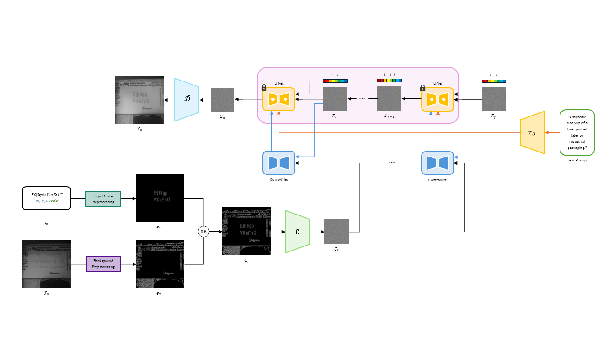

# 🧠 Synthetic Data Generation for Robust Optical Character Verification in Industrial Laser Marking


---

## Project Description

This project develops a synthetic data generation pipeline to enhance Optical Character Verification (OCV) systems for industrial laser marking applications. By leveraging diffusion models (Stable Diffusion XL with ControlNet), we generate high-fidelity synthetic samples that address key limitations in real-world datasets:

- Imbalanced character distributions
- Limited defect examples (misplacements, beam distortions, surface defects)
- Restricted background and scale diversity



The synthetic dataset enables training of robust OCV models without costly real-world data collection. A YOLOv11-based detection pipeline demonstrates the utility of synthetic data for character recognition and defect detection.


---

## Key Features

- **Diffusion-based Synthetic Data Generation**:
  - Fine-tuned ControlNet architecture conditioned on Canny edge maps
  - Generates varied characters, scales, backgrounds, and simulated defects
  - Preserves industrial packaging visual style

- **Defect Simulation**:
  - Invalid placement (outside marking zone)
  - Bad surface (wrinkles, reflections)
  - Laser beam defects (blurring, over/under-exposure)
  - Laser deflection defects (position errors)
  - Unmatched codes

- **Detection Pipeline**:
  - YOLOv11-based character localization and recognition
  - Error classification system
  - Achieves >96% precision on validation set
    
---

## Repository Structure

```bash
Synthetic-Data-Generation-for-Robust-OCV/
├── data/ # Dataset samples (real and synthetic)
│ ├── real/ # Original industrial images subset
│ └── synthetic/ # Generated samples subsets
├── models/ # Pretrained model download scripts 
│ ├── controlnet/ # Fine-tuned ControlNet checkpoint
│ └── yolov11/ # Trained detection model
├── notebooks/ # Jupyter notebooks for exploration
│ ├── data_generation/ # Generative Approach Exploration
│ └── code_detection/ # Detection and Recognition Exploration
├── scripts/ # Main processing scripts
│ ├── data_generation/ # Synthetic data pipeline
│ ├── code_detection/ # Detection pipeline
│ └── training/ # Model training scripts
├── docs/ # Project documentation
└── img/ # Figures and visualizations
```
---

## 👩‍💻 Author

- **Julia Garcia Torné**  
  Supervised by **David Castells Rufas**  
  Academic Year: 2024–2025  
  Universitat Autònoma de Barcelona

---

